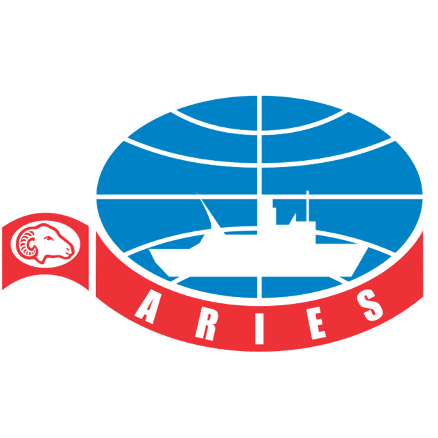

# Aries Marine ERP

**AI-Native Enterprise Resource Planning Platform** for Aries Marine Consultancy LLC — Abu Dhabi, UAE.



---

## Overview

Aries Marine ERP is a comprehensive, AI-powered enterprise platform designed specifically for marine consultancy operations in the Gulf region. It consists of a modern React frontend and a Python backend built on a modernized Frappe framework with async PostgreSQL, Redis, and distributed job processing.

---

## Project Structure

```
aries-marine-erp/
├── README.md                 # This file
├── frontend/                 # React SPA (Vite + TypeScript + Tailwind)
│   ├── README.md
│   ├── package.json
│   ├── vite.config.ts
│   ├── tailwind.config.js
│   ├── tsconfig.json
│   ├── public/
│   │   ├── aries-logo-transparent.png   # Brand logo
│   │   ├── aries-logo.png
│   │   └── aries-logo-large.png
│   ├── src/
│   │   ├── App.tsx           # Router (HashRouter, 20 routes)
│   │   ├── main.tsx          # Entry point
│   │   ├── index.css         # Global styles + Inter font
│   │   ├── types/index.ts    # 20 TypeScript interfaces
│   │   ├── lib/api.ts        # Mock API with realistic data
│   │   ├── store/useStore.ts # Zustand state management
│   │   ├── components/
│   │   │   ├── layout/       # AppShell, Sidebar, Header, AI Chat
│   │   │   └── ui/           # 40+ shadcn/ui components
│   │   └── pages/            # 20 page components
│   └── dist/                 # Production build
└── backend/                  # Modernized Frappe Framework (Python)
    ├── frappe/               # Core framework (33,659 lines)
    │   ├── database/
    │   │   ├── postgres/     # asyncpg PostgreSQL driver
    │   │   │   └── database.py    (1,761 lines)
    │   │   └── sqlite/
    │   ├── redis_client.py   # Redis + FakeRedis fallback
    │   ├── worker.py         # ARQ distributed background jobs
    │   ├── rate_limiter.py   # Sliding-window rate limiting
    │   ├── sessions.py       # Token-based auth sessions
    │   ├── cache_manager.py  # Redis-backed caching
    │   ├── realtime.py       # Pub/sub event system
    │   ├── auth.py           # Authentication layer
    │   ├── api.py            # REST API handlers
    │   ├── app.py            # FastAPI/Frappe app factory
    │   ├── handler.py        # Request routing
    │   ├── permissions.py    # RBAC permission system
    │   ├── model/            # Document ORM
    │   ├── core/             # Core DocTypes
    │   ├── desk/             # Desk UI backend
    │   ├── workflow/         # Workflow engine
    │   ├── email/            # Email handling
    │   ├── integrations/     # Third-party integrations
    │   ├── website/          # Website serving (Jinja2)
    │   ├── printing/         # PDF generation
    │   ├── utils/            # Utility functions
    │   └── types/            # Type definitions
    └── sites/                # Site configurations
```

---

## Frontend

### Tech Stack
| Layer | Technology |
|-------|------------|
| Framework | React 19 + TypeScript |
| Build | Vite 7.2.4 |
| Styling | Tailwind CSS 3.4.19 |
| UI | shadcn/ui (40+ components) |
| State | Zustand |
| Routing | react-router-dom (HashRouter) |
| Charts | recharts |
| Icons | lucide-react |
| Dates | date-fns |

### Running the Frontend

```bash
cd frontend
npm install
npm run dev      # Development server
npm run build    # Production build
```

### Features (20 Screens)
- **Login** — Branded auth with demo credentials
- **Dashboard** — KPIs, revenue line chart, project pie chart
- **Enquiries** — Sales pipeline with approval workflow
- **Personnel** — Employee directory with cert tracking (IRATA, BOSIET, STCW)
- **Assets** — Equipment registry with calibration status
- **Projects** — Progress tracking with budget management
- **Stock** — Inventory across 3 warehouses
- **Invoices** — UAE VAT invoicing
- **Payments** — Multi-method payment tracking
- **Suppliers** — Vendor directory with ratings
- **Purchase Orders** — PO builder and tracker
- **Wiki** — Markdown knowledge base with editor
- **Workflow Builder** — Visual automation builder
- **Persona Manager** — AI persona configuration
- **Channel Hub** — Omni-channel connections
- **RAG Admin** — Knowledge indexing dashboard
- **Dynamic Renderer** — AI-generated dynamic UIs
- **Letterhead Generator** — Branded document generator

### Demo Login
- **Email**: `admin@ariesmarine.com`
- **Password**: any password (demo mode)

---

## Backend

### Modernized Frappe Framework

The backend is a **modernized version of the Frappe framework** with enterprise-grade infrastructure:

| Component | Technology | File |
|-----------|------------|------|
| **PostgreSQL** | `asyncpg` (async driver) | `frappe/database/postgres/database.py` (1,761 lines) |
| **Redis** | `redis.asyncio` + FakeRedis fallback | `frappe/redis_client.py` (221 lines) |
| **Background Jobs** | ARQ (distributed worker) | `frappe/worker.py` (114 lines) |
| **Rate Limiting** | Redis Sorted Sets sliding window | `frappe/rate_limiter.py` (164 lines) |
| **Sessions** | Token-based with Redis | `frappe/sessions.py` (240 lines) |
| **Caching** | Redis-backed with TTL | `frappe/cache_manager.py` (260 lines) |
| **Realtime** | Pub/sub event system | `frappe/realtime.py` (184 lines) |
| **Auth** | JWT + RBAC | `frappe/auth.py` (10,137 lines) |
| **API** | REST handlers | `frappe/api.py` (10,312 lines) |
| **App** | FastAPI/Frappe factory | `frappe/app.py` (30,187 lines) |

**Total**: 33,659 lines of Python across 76 files

### Key Modernizations

1. **Native PostgreSQL with asyncpg** — Full async DB operations with JSONB columns, tsvector search, sequence-based IDs
2. **Redis/Dragonfly State** — Distributed rate limiting (Sorted Sets), session storage, caching with health checks
3. **ARQ Background Jobs** — Distributed job queue with pickle serialization, retry logic, result retention
4. **Token-based Sessions** — Stateless JWT sessions stored in Redis
5. **In-memory + Redis Pub/Sub** — Realtime event broadcasting across workers

### Running the Backend

```bash
# Requires Python 3.11+, PostgreSQL, Redis
cd backend
pip install -r requirements.txt

# Setup database
python -m frappe.installer

# Run server
python -m frappe.app

# Run ARQ worker (separate process)
python -m frappe.worker
```

### Environment Variables
```env
DB_HOST=localhost
DB_PORT=5432
DB_NAME=aries_marine
DB_USER=postgres
DB_PASSWORD=secret
REDIS_URL=redis://localhost:6379
JWT_SECRET=your-secret-key
SITE_NAME=aries-marine.local
```

---

## Deployment

### Frontend
Static SPA — deploy `frontend/dist/` to any static host:
```bash
cd frontend
npm run build
# Deploy dist/ folder
```

**Current deployment**: https://nru747ksojq42.kimi.page

### Backend
Python application — requires PostgreSQL and Redis:
```bash
cd backend
pip install -e .
python -m frappe.app --port 8000
```

---

## Company

**Aries Marine Consultancy LLC**  
Abu Dhabi, United Arab Emirates  
Specializing in ROV inspection, diving support, NDT testing, marine consultancy, and offshore project management across the Middle East.

---

## License

Proprietary — Aries Marine Consultancy LLC
